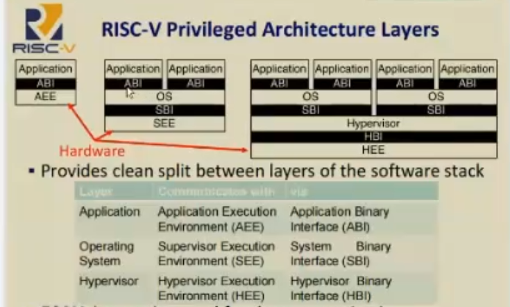

Daily Record 20221119
=====================

## 流水

 [lab0-0-setup-env-run-os1-iKeepo](https://github.com/LearningOS/lab0-0-setup-env-run-os1-iKeepo) [实验设置](https://learningos.github.io/rust-based-os-comp2022/chapter1/0intro.html#id4) 

学习[实验起步指引](https://os2edu.cn/course/106)第一课；

## 知识点

##### 实验起步指引第一课笔记

risc-v是一个规范；

AEE: Application Execution Environment;

SEE: Supervisor Execution Environ,ent;

MSU的特点是引入page页表机制，通过虚拟内存将用户态程序隔离在各自虚拟内存区域；

这里谈及特权级是cpu指令架构层面，也就是硬件层面，而非软件层面；

CSR: Control/Status Register, 更高特权级可以操作更多的CSR，Risc-V专有，每个特权级只能操作比自己低的特权级拥有的CSR；每一个核有4K CSR, 分给4个特权级用，每一级最多1024个。

标志位可以提供逻辑信息；多位每一位都有自己作用；

PMP: Physical Memory Protection; 虚拟内存优先于PMP；

一个单元Unit对应有一组寄存器去辅助控制；

事件Event分为：

- Synchronous events : Exceptions;

  发生原因明确，是由某一条指令导致；

  处理完后重复执行T指令；

- Asynchronouse events: Interrupts;

  并不是因为某一条指令的行为造成，是外部事件造成；

  处理完后执行T+1指令；

## 总结

这应该是第三遍看lab0-0,终于能磕磕绊绊看懂，今天看一下老师课程，确实有帮助。

## 下次学习入口

 [lab0-0-setup-env-run-os1-iKeepo](https://github.com/LearningOS/lab0-0-setup-env-run-os1-iKeepo) [实验设置](https://learningos.github.io/rust-based-os-comp2022/chapter1/0intro.html#id4) 

##### [返回Home](../../../README.md)

